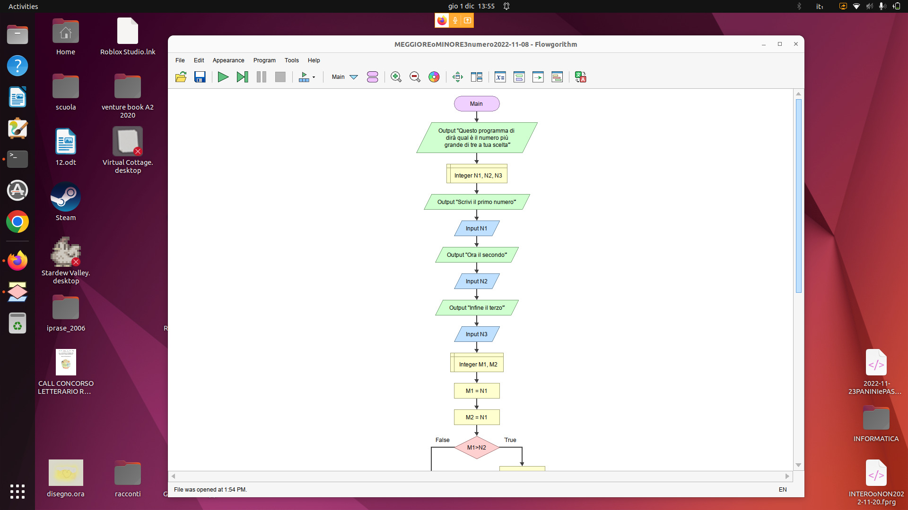

# flowgorithm_linux
Installation instructions to use [Flowgorithm](http://flowgorithm.org) on Linux / Ubuntu 20.04

According to [Wikipedia](https://en.wikipedia.org/wiki/Flowgorithm)
> Flowgorithm is a graphical authoring tool which allows users to write and execute programs using flowcharts.

It is sometimes used in schools to introduce computer science. Unfortunately, it is available only for Windows, which is a problem for students using Linux or macOS. Luckily, using [Wine](https://winehq.org) and [Wine-Mono](https://wiki.winehq.org/Mono), you can make it work. You need to use some commands in the terminal to make it happen. If you find errors or inaccuracies in the installation instructions below, please open an [issue here on GitHub](https://github.com/emanuele/flowgorithm_linux/issues).

In short: Wine is a software layer that runs Windows applications and translates the calls from the Windows operating system to the Linux operating system. So you can run Window's `exe` files on Linux and it is fast enough to be used for [videogames](https://en.wikipedia.org/wiki/Proton_(software)). [Mono](https://en.wikipedia.org/wiki/Mono_(software)) is the open source implementation of the proprietary [.NET framework](https://en.wikipedia.org/wiki/.NET_Framework) developed by Microsoft to create software applications. [Devin Cook](http://devincook.com), the author of Flowgorithm, uses the .NET framework to make Flowgorithm. Wine-Mono is a software package to make Mono ready for Wine. So, by mixing together the three ingredients, Wine, Wine-Mono, and Flowgorithm, you have chances to run Flowgorithm on Linux, and most probably on other Unix-like operating systems too.

## Installation instructions for Linux (Ubuntu 20.04)

1. Install `wine` to get several new commands in the terminal, like `wine` and `wine64`:
```
sudo apt install wine
```


2. Download `wine-mono`. At the time of writing, the latest version is `7.4.0`, which you can find here:

  https://dl.winehq.org/wine/wine-mono/7.4.0/
  
  https://dl.winehq.org/wine/wine-mono/7.4.0/wine-mono-7.4.0-x86.msi

3. Install `wine-mono`
```
wine64 uninstaller
```
(then click on *install* and choose the file you just downloaded `wine-mono-7.4.0-x86.msi`, and press *OK*)

4. Download Flowgorithm. We used the *Executable Only* version because it does not require any installation, and the latest release `v3.31`. The *Windows Installer* version should work as well (untested). You can find the file at:

http://flowgorithm.org/download/index.html


5. Unzip the downloaded file `Flowgorithm-exe-only.zip` to get `Flowgorithm.exe`
```
  unzip Flowgorithm-exe-only.zip
```

6. Run Flowgorithm.exe via `wine64`
```
  wine64 Flowgorithm.exe
```

Et voilà:

  

Next time, you just just need to execute the last step to run Flowgorithm on Linux.


Emanuele & Sibilla

PS: apparently, following the same logic above, you can run [Flowgorithm on macOS](https://github.com/jostasik/Flowgorithm-macOS) too.
